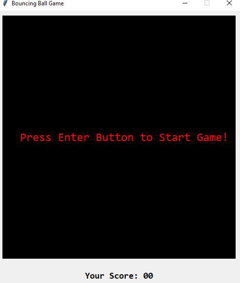
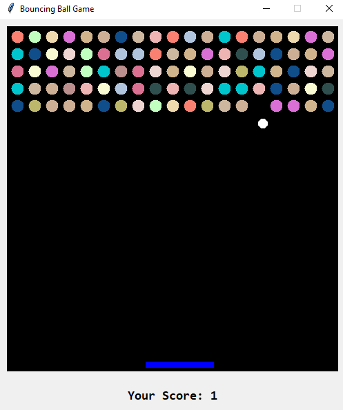
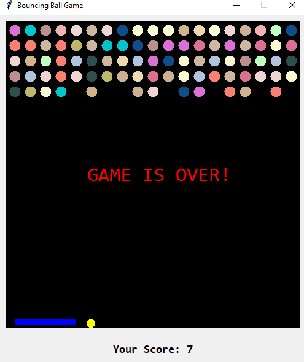

# Bouncing Ball Game

<p align="justify">✍A fun and interactive Bouncing Ball Game built with Python and Tkinter. In this game, players control a paddle to bounce a ball and break bricks arranged at the top of the game window. The goal is to break all bricks without letting the ball touch the bottom of the window.</p>

## Features

- Interactive GUI built with Tkinter.
- Real-time game updates.
- Controls for moving the paddle left and right.
- Score tracking and display.
- Colorful bricks and ball.
- Pause and resume game functionality.

## Prerequisites

Before running this game, you'll need to have Python installed on your system. Additionally, ensure the following Python package is installed:

- `Pillow` (PIL) for image processing.

You can install Pillow using pip:

```bash
pip install Pillow
```

<b>Note:</b> The game primarily uses Tkinter (which is included with Python) for the GUI.

### Running the Application
To start the game, navigate to the directory containing the script and run it with Python:

``` base
python your_file_name.py
```

### How to Play
- Press the Enter key to start the game.
- Use the Left and Right arrow keys to move the paddle.
- The goal is to break all the bricks by bouncing the ball off the paddle.
- Press the Spacebar to pause and resume the game.
- Avoid letting the ball touch the bottom of the game window.


### Control the Game
- Left Arrow Key: Move paddle left.
- Right Arrow Key: Move paddle right.
- Enter Key: Start the game.
- Spacebar: Pause/resume the game.

### Output Screen

- Initial stage of the game.
#### Starting point of the game
  

- Playing the game
#### Playing the game
   


-  End of the game
#### Ending point of the game
  